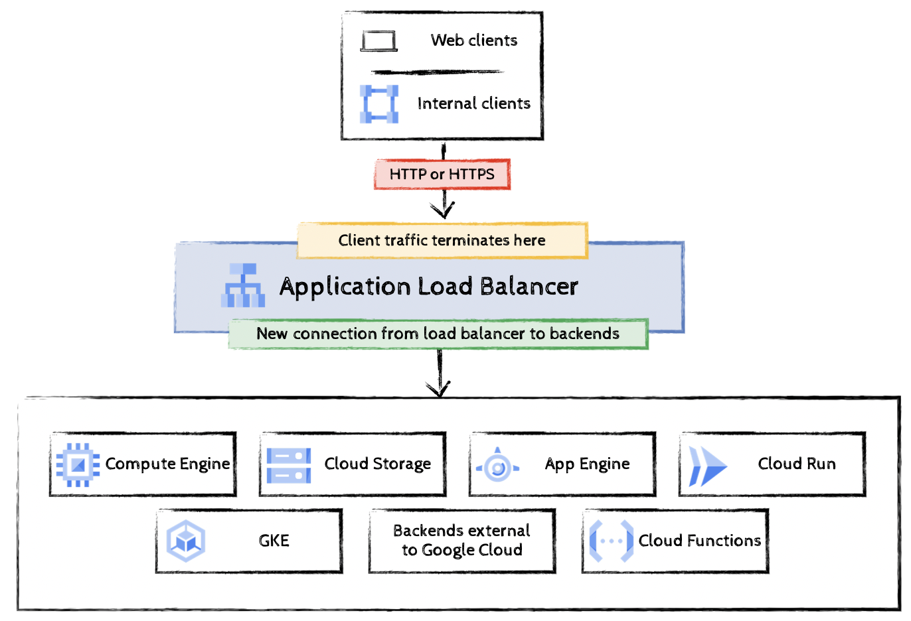
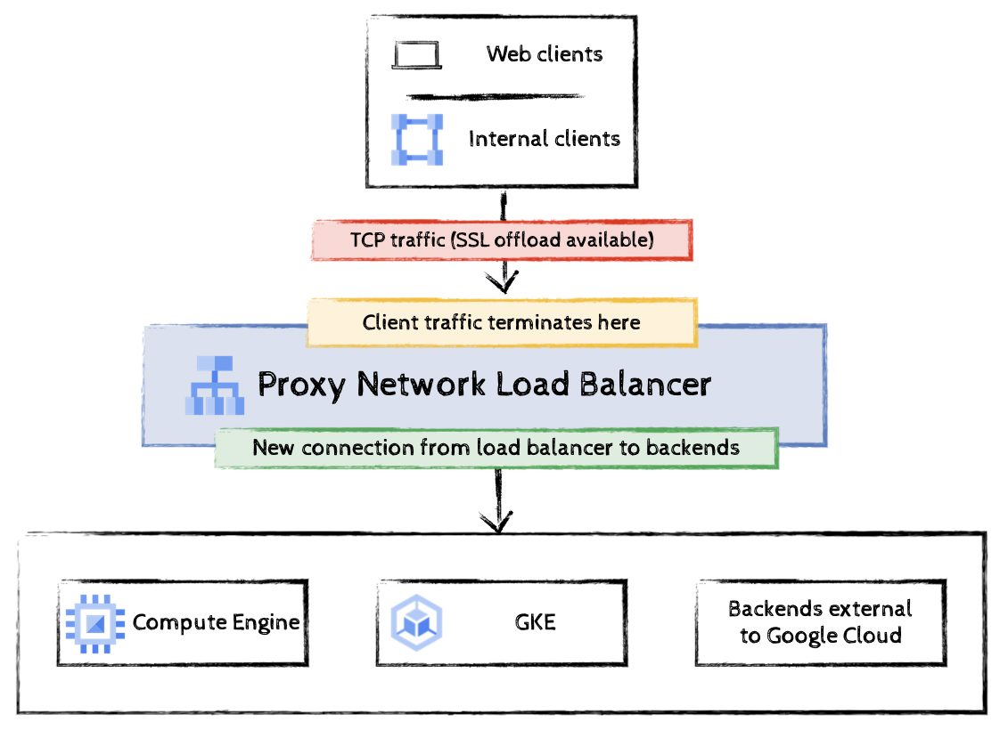
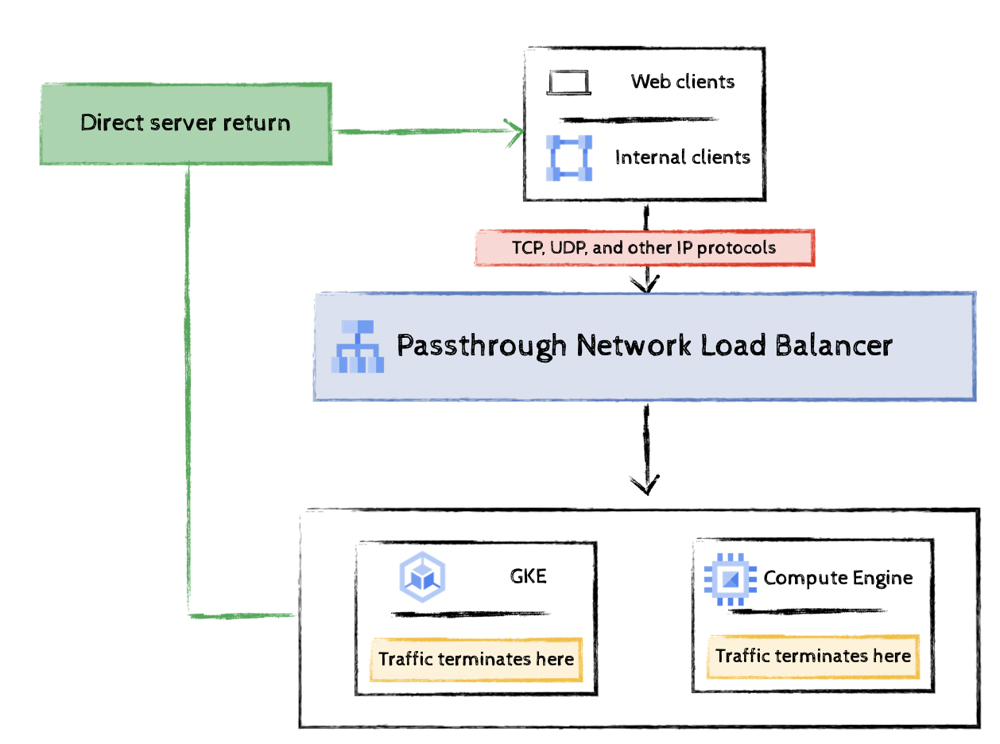
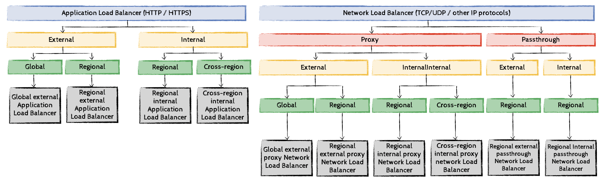
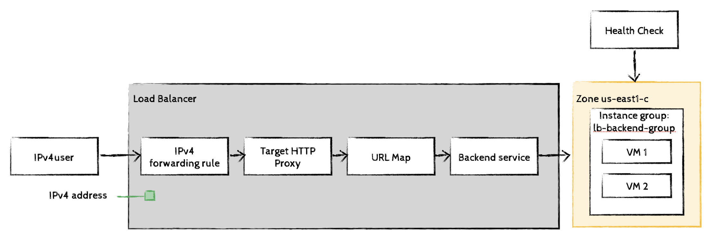

# Setup of load balancers
## Introduction

A load balancer distributes user traffic across multiple instances of your applications. By spreading the load, load balancing reduces the risk that your applications experience performance issues. 

Cloud Load Balancing offers a comprehensive portfolio two types of load balancers: 
- [Application (HTTP) Load Balancers](https://cloud.google.com/compute/docs/load-balancing/http/)
 and 
- [Network Load Balancer](https://cloud.google.com/compute/docs/load-balancing/network/)

### Application Load Balancers

Application Load Balancers are proxy-based Layer 7 load balancers that enable you to run and scale your services behind an anycast IP address. The Application Load Balancer distributes HTTP and HTTPS traffic to backends hosted on a variety of Google Cloud platforms—such as Compute Engine and Google Kubernetes Engine (GKE)—as well as external backends outside Google Cloud.

The following diagram shows a sample Application Load Balancer architecture.



### Network Load Balancers

Network Load Balancers are Layer 4 load balancers that can handle TCP, UDP, or other IP protocol traffic. These load balancers are available as either 
- proxy load balancers or 
- passthrough load balancers. 

### Proxy Network Load Balancers
Proxy Network Load Balancers are Layer 4 reverse proxy load balancers that distribute TCP traffic to virtual machine (VM) instances in your Google Cloud VPC network. Traffic is terminated at the load balancing layer and then forwarded to the closest available backend by using TCP. 

The following diagram shows a sample Proxy Network Load Balancers architecture.



### Passthrough Network Load Balancers
Passthrough Network Load Balancers are Layer 4 regional, passthrough load balancers. These load balancers distribute traffic among backends in the same region as the load balancer. They are implemented by using Andromeda virtual networking and Google Maglev.



### Deployment Modes for Cloud Load Balancing.
GCP offers several deployment modes for Cloud Load Balancing, depending on scope (global, regional or cross-region) and „client exposure“ (internal and external).

- scope 
    - global:  A global load balancer denotes a load balancer with components (backends) in multiple regions. Access is provided by using a single anycast IP address and by providing IPv6 termination at the load balancer.
    - regional: A regional load balancers denotes a load balancer with components (backends) in in a single region.
    - cross-region: A cross-region load balancer denotes a load balancer with components (backends) in multiple regions. Access is provided by using a regional internal IP address.

- „client exposure“ 
    - external: an external load balancer denotes a load balancer that accepts Internet traffic
    - internal: an internal load balancer only accepts RFC 1918 (private IP addresses) traffic.

The different deployment modes are shown in the following diagram:




## Create a Network load balancer

In the first example we create three Compute Engine VM instances and install Apache on them, then add a firewall rule that allows HTTP traffic to reach the instances. Then we add a load balancing service (Network Load Balancer). 

## Setup using gcloud

### Initial setup
1. Click Activate Cloud Shell at the top of the Google Cloud console.
2. (Optional) You can list the active account name with this command:
```
gcloud auth list
```
3. Set the default region and default zone (in this case us-east1 and us-east1-c):
```
gcloud config set compute/region us-east1
gcloud config set compute/zone us-east1-c
```
## Create multiple web server instances

For this load balancing scenario, we create three Compute Engine VM instances and install Apache on them, then add a firewall rule that allows HTTP traffic to reach the instances.

1. Create a virtual machine www1 in the default zone using the following code:

```
gcloud compute instances create www1 \
    --zone=us-east1-c \
    --tags=network-lb-tag \
    --machine-type=e2-small \
    --image-family=debian-11 \
    --image-project=debian-cloud \
    --metadata=startup-script='#!/bin/bash
      apt-get update
      apt-get install apache2 -y
      service apache2 restart
      echo "
<h3>Web Server: www1</h3>" | tee /var/www/html/index.html'
```

2. Create a virtual machine www2 in the default zone using the following code:
```
gcloud compute instances create www2 \
    --zone=us-east1-c \
    --tags=network-lb-tag \
    --machine-type=e2-small \
    --image-family=debian-11 \
    --image-project=debian-cloud \
    --metadata=startup-script='#!/bin/bash
      apt-get update
      apt-get install apache2 -y
      service apache2 restart
      echo "
<h3>Web Server: www2</h3>" | tee /var/www/html/index.html'
```

3. Create a virtual machine www3 in the default zone using the following code:
```
gcloud compute instances create www3 \
    --zone=us-east1-c  \
    --tags=network-lb-tag \
    --machine-type=e2-small \
    --image-family=debian-11 \
    --image-project=debian-cloud \
    --metadata=startup-script='#!/bin/bash
      apt-get update
      apt-get install apache2 -y
      service apache2 restart
      echo "
<h3>Web Server: www3</h3>" | tee /var/www/html/index.html'
```

4. Create a firewall rule to allow external traffic to the VM instances:
```
gcloud compute firewall-rules create www-firewall-network-lb \
    --target-tags network-lb-tag --allow tcp:80
```

### Configure the load balancing service

1. Create a static external IP address for your load balancer:

```
gcloud compute addresses create network-lb-ip-1 \
  --region us-east1
```

2. Add a legacy HTTP health check resource
```
gcloud compute http-health-checks create basic-check
```

3. Add a target pool in the same region as your instances. Run the following to create the target pool and use the health check, which is required for the service to function:

```
gcloud compute target-pools create www-pool \
  --region us-east1 --http-health-check basic-check
```

4. Add the instances to the pool:
```
gcloud compute target-pools add-instances www-pool \
    --instances www1,www2,www3
```

5. Add a forwarding rule:
```
gcloud compute forwarding-rules create www-rule \
    --region  us-east1 \
    --ports 80 \
    --address network-lb-ip-1 \
    --target-pool www-pool
```

### Sending traffic to the instances

Now that the load balancing service is configured, we can start sending traffic to the forwarding rule and watch the traffic be dispersed to different instances.

1. With the following command we are able to  view the external IP address of the www-rule forwarding rule used by the load balancer:

```
gcloud compute forwarding-rules describe www-rule --region us-east1
```

2. Access the external IP address

```
IPADDRESS=$(gcloud compute forwarding-rules describe www-rule --region us-east1 --format="json" | jq -r .IPAddress)
```

3. Show the external IP address

```
echo $IPADDRESS
```

4. Use curl command to access the external IP address, replacing IP_ADDRESS with an external IP address from the previous command:

```
while true; do curl -m1 $IPADDRESS; done
```

The response from the curl command alternates randomly among the three instances. If your response is initially unsuccessful, wait approximately 30 seconds for the configuration to be fully loaded and for your instances to be marked healthy before trying again.

5. Use Ctrl + C to stop running the command.

## Create an HTTP load balancer

HTTP(S) Load Balancing is implemented on Google Front End (GFE). GFEs are distributed globally and operate together using Google's global network and control plane. You can configure URL rules to route some URLs to one set of instances and route other URLs to other instances.
Requests are always routed to the instance group that is closest to the user, if that group has enough capacity and is appropriate for the request. If the closest group does not have enough capacity, the request is sent to the closest group that does have capacity.
To set up a load balancer with a Compute Engine backend, your VMs need to be in an instance group. The managed instance group provides VMs running the backend servers of an external HTTP load balancer. For this lab, backends serve their own hostnames.

The objects that we need to configure are shown in the following diagram:



1. First, create the load balancer template:

```
gcloud compute instance-templates create lb-backend-template \
   --region=us-east1 \
   --network=default \
   --subnet=default \
   --tags=allow-health-check \
   --machine-type=e2-medium \
   --image-family=debian-11 \
   --image-project=debian-cloud \
   --metadata=startup-script='#!/bin/bash
     apt-get update
     apt-get install apache2 -y
     a2ensite default-ssl
     a2enmod ssl
     vm_hostname="$(curl -H "Metadata-Flavor:Google" \
     http://169.254.169.254/computeMetadata/v1/instance/name)"
     echo "Page served from: $vm_hostname" | \
     tee /var/www/html/index.html
     systemctl restart apache2'
```

Managed instance groups (MIGs) let you operate apps on multiple identical VMs. You can make your workloads scalable and highly available by taking advantage of automated MIG services, including: autoscaling, autohealing, regional (multiple zone) deployment, and automatic updating.

2. Create a managed instance group based on the template:

```
gcloud compute instance-groups managed create lb-backend-group \
   --template=lb-backend-template --size=2 --zone=us-east1-c
```

3. Create the fw-allow-health-check firewall rule.

```
gcloud compute firewall-rules create fw-allow-health-check \
  --network=default \
  --action=allow \
  --direction=ingress \
  --source-ranges=130.211.0.0/22,35.191.0.0/16 \
  --target-tags=allow-health-check \
  --rules=tcp:80
```

The ingress rule allows traffic from the Google Cloud health checking systems (130.211.0.0/22 and 35.191.0.0/16). This example uses the target tag allow-health-check to identify the VMs

4. Now that the instances are up and running, set up a global static external IP address that your customers use to reach your load balancer:

```
gcloud compute addresses create lb-ipv4-1 \
  --ip-version=IPV4 \
  --global
```

5. Note the IPv4 address that was reserved

gcloud compute addresses describe lb-ipv4-1 \
  --format="get(address)" \
  --global

6. Create a health check for the load balancer:

```
  gcloud compute health-checks create http http-basic-check \
 --port 80
 ```

 Google Cloud provides health checking mechanisms that determine whether backend instances respond properly to traffic.

 7. Create a backend service

```
 gcloud compute backend-services create web-backend-service \
  --protocol=HTTP \
  --port-name=http \
  --health-checks=http-basic-check \
  --global
```

8. Add your instance group as the backend to the backend service:

```
gcloud compute backend-services add-backend web-backend-service \
  --instance-group=lb-backend-group \
  --instance-group-zone=us-east1-c \
  --global
```

9. Create a URL map to route the incoming requests to the default backend service:
```
gcloud compute url-maps create web-map-http \
    --default-service web-backend-service
```

10. Create a target HTTP proxy to route requests to your URL map:

```
gcloud compute target-http-proxies create http-lb-proxy \
    --url-map web-map-http
```

11. Create a global forwarding rule to route incoming requests to the proxy
```
gcloud compute forwarding-rules create http-content-rule \
   --address=lb-ipv4-1\
   --global \
   --target-http-proxy=http-lb-proxy \
   --ports=80
```

This was the last step to create an L7 HTTP(S) load balancer.
